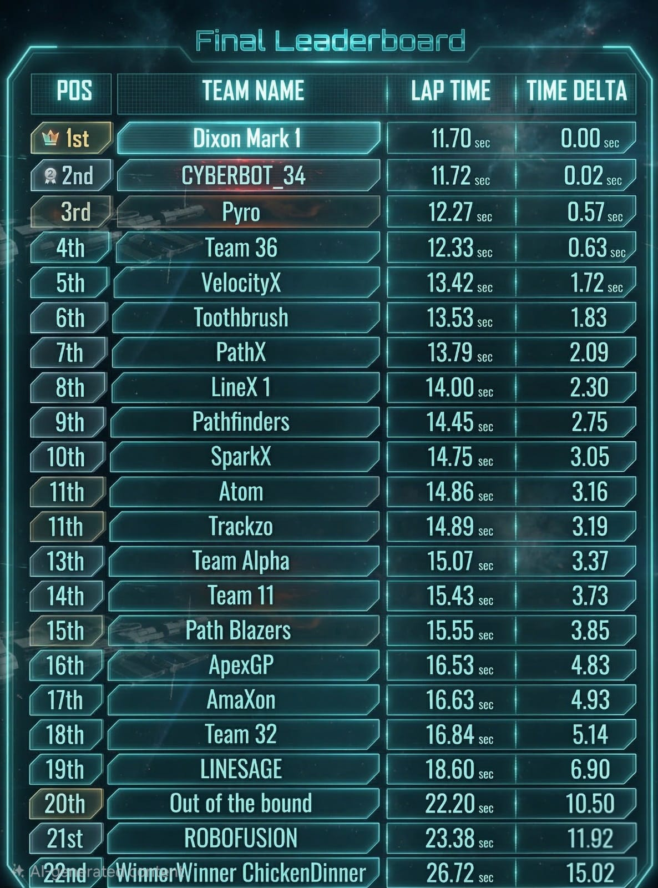
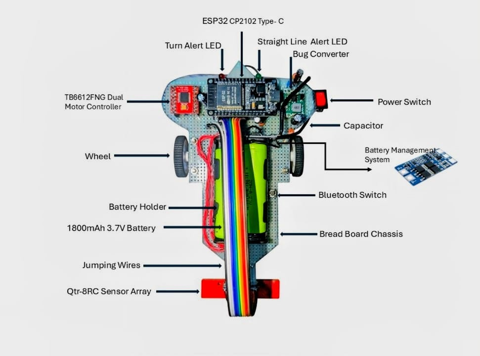

# Autonomous High-Speed Line Follower Robot (LFR) 🤖🏁

**🏆 1st Place Winner - 2026 DEEEP SPEED Line Follower Challenge** *Official Lap Time: 11.70s | Team: Dixon Mark 1*

## 🌟 Project Overview
Developed as part of the EE1010 course at the **University of Peradeniya**. Our robot, **Dixon Mark 1**, emerged as the champion out of 22 competing teams, winning the final with a record time of **11.70 seconds**—a hard-fought victory with a 0.02s margin!

This project demonstrates an end-to-end engineering workflow, including hardware integration, embedded C++ logic, and real-time control system optimization.

## 🚀 Technical Innovations
To achieve championship-level speed and stability, we engineered several advanced features:

* **Dual PID Control:** The system dynamically switches between 'Aggressive' tuning for sharp corners and 'Stable' tuning for high-speed straightaways.
* **Bluetooth Live Tuning:** Integrated a custom ESP32 mobile interface to tune $K_p$, $K_i$, and $K_d$ values wirelessly in real-time, eliminating the need for constant re-flashing.
* **Auto-Calibration:** Implemented sophisticated startup logic for the QTR-8RC sensors to automatically detect surface IR reflectivity and set dynamic thresholds based on ambient light.
* **Optimized Hardware:** Centralized castor mounting to create a perfect pivot point, drastically reducing physical resistance during high-speed turns.

## 🛠️ System Architecture

| Component | Specification |
| :--- | :--- |
| **Microcontroller** | ESP32 (32-bit High Performance) |
| **Motor Driver** | TB6612FNG Dual H-Bridge |
| **Sensors** | QTR-8RC Reflectance Sensor Array |
| **Motors** | 2x N20 500 RPM Micro Gear Motors |
| **Power** | 2S Li-ion Battery with BMS Protection |
| **Regulation** | MP1584 Buck Converter |

## 📊 Performance Visualization
The robot utilizes a weighted average system for error calculation:
$$Error = \frac{\sum (Value_i \times Weight_i)}{\sum Value_i}$$

The PID algorithm then applies the necessary correction to the base motor speed to maintain perfect line alignment at high velocities.

## 📂 Repository Structure
* `/01_Firmware`: Final optimized ESP32 C++ source code.
* `/02_CAD_and_Design`: Chassis blueprints and circuit schematics.
* `/03_Media`: Championship videos, hardware photos, and the official leaderboard.
* `/04_Documents`: Full engineering project journal (PDF).

---
**Team Members (Group 20):**
* **E/24/118 - Ravija Gayanuka** (Hardware Integration & Control Logic)
* E/24/117, E/24/119, E/24/120, E/24/121, E/24/122
